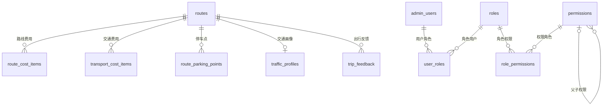

# chatbi.db 表结构与关系简表

数据库文件：`data\chatbi.db`  
整理日期：2026-09-07  
依据：只读读取 SQLite 建表语句、字段、索引和外键定义。字段用途根据名称归纳，关系以数据库实际声明的外键为准。

## 1. 总体结构

共 **11 张业务表**，分为两个模块；另有 SQLite 内部表 `sqlite_sequence`，用于记录自增序号。

| 模块 | 表 | 用途 |
| --- | --- | --- |
| 路线 | `routes` | 路线基础信息、徒步指标、配套信息及数据来源 |
| 路线 | `route_cost_items` | 路线相关费用明细 |
| 路线 | `transport_cost_items` | 不同交通方式的费用明细 |
| 路线 | `route_parking_points` | 路线停车点 |
| 路线 | `traffic_profiles` | 路线交通耗时与拥堵画像 |
| 路线 | `trip_feedback` | 实际出行耗时反馈 |
| 权限 | `admin_users` | 后台用户 |
| 权限 | `roles` | 角色 |
| 权限 | `permissions` | 菜单、接口权限，支持父子层级 |
| 权限 | `user_roles` | 用户与角色关联 |
| 权限 | `role_permissions` | 角色与权限关联 |

两组表之间没有声明外键；`trip_feedback` 也没有关联后台用户的外键字段。

## 2. 表关系

| 主表字段 | 引用字段 | 关系 | 删除主记录时 |
| --- | --- | --- | --- |
| `routes.id` | `route_cost_items.route_id` | 一对多 | 级联删除费用明细 |
| `routes.id` | `transport_cost_items.route_id` | 一对多 | 级联删除交通费用 |
| `routes.id` | `route_parking_points.route_id` | 一对多 | 级联删除停车点 |
| `routes.id` | `traffic_profiles.route_id` | 一对零或一 | 级联删除交通画像 |
| `routes.id` | `trip_feedback.route_id` | 一对多 | 级联删除反馈 |
| `admin_users.id` | `user_roles.user_id` | 一对多 | 级联删除用户角色关联 |
| `roles.id` | `user_roles.role_id` | 一对多 | 级联删除用户角色关联 |
| `roles.id` | `role_permissions.role_id` | 一对多 | 级联删除角色权限关联 |
| `permissions.id` | `role_permissions.permission_id` | 一对多 | 级联删除角色权限关联 |
| `permissions.id` | `permissions.parent_id` | 自关联，一个父权限可有多个子权限 | 子权限的 `parent_id` 置空 |

- 用户与角色通过 `user_roles` 构成多对多关系。
- 角色与权限通过 `role_permissions` 构成多对多关系。
- `traffic_profiles.route_id` 同时为主键和外键，因此同一路线最多有一条交通画像。
- 上述删除行为是外键定义；SQLite 连接须启用 `PRAGMA foreign_keys = ON` 才会执行外键约束。本文未验证应用连接是否启用。
- 所有外键的更新策略均为 `NO ACTION`。

## 3. 各表主要字段

### 3.1 routes：路线主表

主键：`id TEXT`。

| 字段组 | 字段 | 含义 |
| --- | --- | --- |
| 基础信息 | `name`、`start_location`、`end_location`、`latitude`、`longitude` | 名称、起终点、经纬度 |
| 徒步指标 | `distance_km`、`ascent_m`、`highest_altitude_m`、`hiking_minutes` | 距离、爬升、最高海拔、徒步时长 |
| 分类 | `difficulty`、`duration_days`、`route_type` | 难度、天数、路线类型 |
| JSON 文本 | `best_seasons_json`、`scenery_json`、`risks_json`、`transport_modes_json`、`group_tour_search_terms_json` | 适宜季节、景观、风险、交通方式、跟团搜索词 |
| 费用概览 | `cost_min_cny`、`cost_max_cny` | 费用下限、上限，单位人民币元 |
| 配套说明 | `parking`、`supplies`、`signal`、`camping` | 停车、补给、信号、露营说明 |
| 配套与穿越 | `has_toilet`、`has_supply_shop`、`is_traverse`、`traverse_transfer_minutes` | 厕所、补给店、是否穿越、穿越接驳时长 |
| 来源与审核 | `source_url`、`source_name`、`collected_at`、`updated_at`、`confidence`、`reviewed` | 来源、采集与更新时间、置信度、审核标记 |

主要约束：距离、徒步时长、天数必须大于 0；爬升、最高海拔、穿越接驳时长不能为负；难度为 `easy / moderate / hard / expert`；置信度范围为 0～1；布尔标记限定为 0 或 1，默认 0。跟团搜索词默认 `'[]'`。

### 3.2 路线附属表

以下各表均通过 `route_id TEXT` 关联 `routes.id`。

| 表 | 主键 | 主要业务字段 | 主要约束 |
| --- | --- | --- | --- |
| `route_cost_items` | `id INTEGER`，自增 | `name`、`cost_type`、`billing_unit`、`min_cny`、`max_cny`、`source_url`、`updated_at` | 费用类型：`ticket / shuttle / waste / parking / other`；计费单位：`person / vehicle / group`；`0 ≤ min_cny ≤ max_cny` |
| `transport_cost_items` | `id INTEGER`，自增 | `transport_mode`、`name`、`cost_type`、`billing_unit`、`min_cny`、`max_cny`、`source_url`、`updated_at` | 交通方式：`self_drive / public_transit / carpool / group_tour`；费用类型：`fuel / toll / train / bus / other`；计费单位同上；`0 ≤ min_cny ≤ max_cny` |
| `route_parking_points` | `id INTEGER`，自增 | `name`、`latitude`、`longitude`、`note`、`is_recommended`、`is_reviewed`、`source_url`、`updated_at` | `(route_id, name)` 唯一；纬度 -90～90，经度 -180～180；两个标记限定为 0 或 1，默认 0 |
| `traffic_profiles` | `route_id TEXT` | 见下文 | 每条路线最多一条；`confidence` 范围为 0～1 |
| `trip_feedback` | `id INTEGER`，自增 | `traveled_at`、`direction`、`actual_minutes`、`congestion_level`、`source`、`notes`、`created_at` | 方向：`outbound / return`；实际耗时大于 0；拥堵级别：`low / medium / high / severe` |

`traffic_profiles` 主要字段：

- 基础单程耗时：`base_one_way_minutes`。
- 工作日、周末、节假日额外耗时范围：`weekday_extra_min/max`、`weekend_extra_min/max`、`holiday_extra_min/max`（每组分别对应 `_min`、`_max` 两个字段）。
- 早晚额外耗时：`morning_extra_minutes`、`evening_extra_minutes`。上述额外耗时字段均默认 0。
- 常见拥堵点：`common_bottlenecks_json`。
- 建议出发、返程时间：`best_departure_time`、`suggested_return_time`。
- 来源与可信度：`source_url`、`updated_at`、`confidence`。

### 3.3 后台权限表

| 表 | 主键或唯一约束 | 主要业务字段 |
| --- | --- | --- |
| `admin_users` | `id INTEGER` 自增主键；`username` 唯一 | `username`、`password_hash`、`display_name`、`email`、`mobile`、`status`、`last_login_at`、`created_at`、`updated_at` |
| `roles` | `id INTEGER` 自增主键；`code` 唯一 | `code`、`name`、`description`、`is_system`、`status`、`created_at`、`updated_at` |
| `permissions` | `id INTEGER` 自增主键；`code` 唯一 | `code`、`name`、`resource_type`、`resource`、`action`、`parent_id`、`sort_order`、`status`、`created_at`、`updated_at` |
| `user_roles` | 无显式主键；`(user_id, role_id)` 联合唯一 | `user_id`、`role_id`、`created_at` |
| `role_permissions` | 无显式主键；`(role_id, permission_id)` 联合唯一 | `role_id`、`permission_id`、`created_at` |

- 用户、角色、权限的 `status` 均限定为 `active / disabled`。
- `roles.is_system` 限定为 0 或 1，默认 0。
- `permissions.resource_type` 限定为 `menu / api`；`parent_id` 可空，`sort_order` 默认 0。
- 两张关联表使用联合唯一约束防止重复分配；删除角色或权限时，删除的是关联记录，不会沿关联表删除用户。

## 4. 结构说明

- 时间字段使用 `TEXT` 存储；以 `_json` 结尾的字段也是 `TEXT`，建表语句没有 JSON 格式校验约束。
- 数据库未声明路线费用概览与费用明细之间的自动汇总关系，也未声明反馈自动更新交通画像的机制。
- 当前索引均由主键或唯一约束自动生成，没有额外的显式索引。
- SQLite 普通表中的 `TEXT PRIMARY KEY` 不自动等同于显式 `NOT NULL`。`routes.id` 和 `traffic_profiles.route_id` 均未单独声明 `NOT NULL`；上方关系图按有效路线标识的业务含义展示。
- 本文件仅整理数据库结构，未读取或导出用户密码哈希等业务数据。
